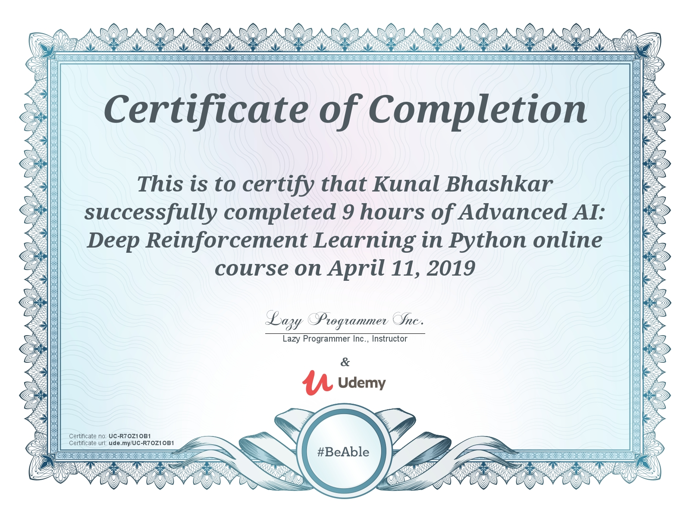

## Reinforcement-Learning

This repository contains following topics:
	* Reinforcement Learning Part_01
	* Reinforc3ment Learning Part_02
	* Reinforcement Learning Part_03

I have completed the udemy course on "Advance AI: Deep Reinforcement Learning in python".

### My Udemy Certificate

<p align="center">
    
</p>

This repository includes **Python implementations of Sutton's &amp; Barto's Reinforcement Learning Book (Ed. 2) algorithms**. The latest draft of the book's second version can be found in this [link](http://incompleteideas.net/book/the-book-2nd.html ). In this repository you may also find the solutions of the book exercises that I've been implementing.

## Course Overview

- Building various deep learning agents (including DQN and A3C)
- We can Apply a variety of advanced reinforcement learning algorithms to any problem
- Q-Learning with Deep Neural Networks
- Policy Gradient Methods with Neural Networks
- Reinforcement Learning with RBF Networks
- Use Convolutional Neural Networks with Deep Q-Learning

[https://www.udemy.com/course/deep-reinforcement-learning-in-python/learn/lecture/6740896#overview](https://www.udemy.com/course/deep-reinforcement-learning-in-python/learn/lecture/6740896#overview)
## Structure

### Folder
This repository is divided into **several folders, every example is related to Reinforcement Learning algo. 

Additionally, `notebooks` sub-folder is present. Such files are interactive Jupyter Notebooks, where users can interact with OpenAI environments and the algorithms available.

## Install

```
pip install -r requirements.txt
```

And run a jupyter process in order to visualize and interact with all the available Jupyter notebooks:

```
jupyter notebook .

```